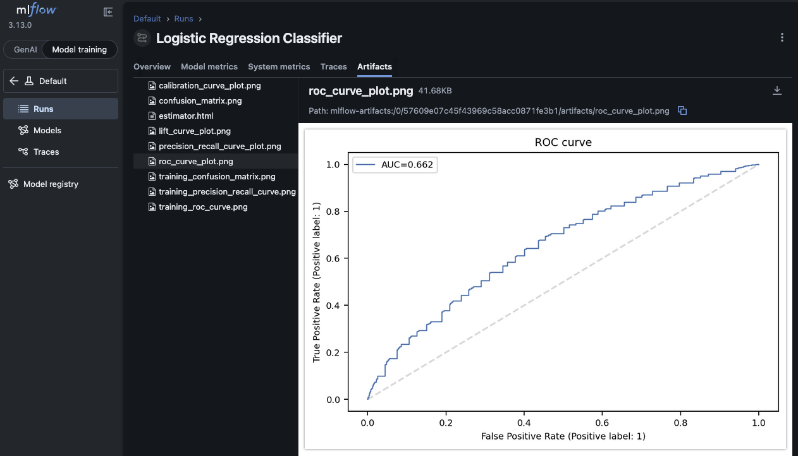
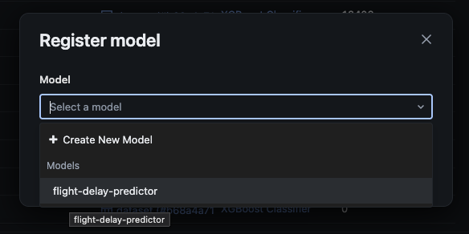
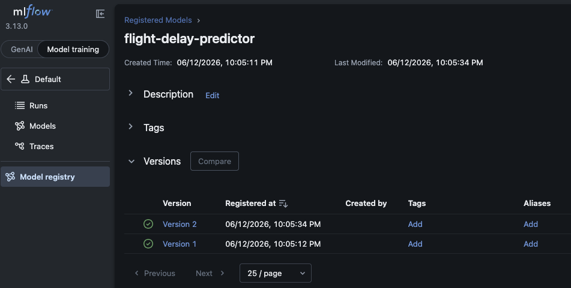

# Challenge Solution <!-- omit in toc -->

[](https://github.com/UribeAlejandro/latam-airlines-challenge/actions/workflows/ci.yml) [](https://github.com/UribeAlejandro/latam-airlines-challenge/actions/workflows/cd.yml)

# Table of Contents <!-- omit in toc -->
- [Requirements](#requirements)
- [Part I](#part-i)
  - [Bugs](#bugs)
  - [Proposed Improvements](#proposed-improvements)
    - [Data Preprocessing](#data-preprocessing)
    - [Data Version Control](#data-version-control)
    - [Model Selection](#model-selection)
    - [Proposed Solution](#proposed-solution)
- [Part II](#part-ii)
  - [Dependency Injection](#dependency-injection)
  - [Tests](#tests)
- [Part III](#part-iii)
  - [GCP - Cloud Run](#gcp---cloud-run)
- [Part IV](#part-iv)
  - [GitHub Actions](#github-actions)
  - [Reusable Workflows](#reusable-workflows)
  - [Continuous Integration](#continuous-integration)
  - [Continuous Delivery](#continuous-delivery)


# Requirements

You need to have the following tools installed in your local environment:

- **Mandatory**
    - [Python](https://www.python.org/downloads/) >= 3.14
    - [uv](https://docs.astral.sh/uv/)
- **Optional**
    - [Docker](https://docs.docker.com/get-docker/)
    - [Docker compose](https://docs.docker.com/compose/install/)

All commands in [Makefile](../Makefile) were modified to run on top of `uv` instead of `python`, so you can run the tests using `make model-test`, `make api-test`, and `make stress-test` as specified in the challenge description. `pip` commands will not work with the current setup, unless you use `uv pip`.

# Part I

<details>

<summary>Description</summary>

In order to operationalize the model, transcribe the `.ipynb` file into the `model.py` file:

- If you find any bug, fix it.
- The DS proposed a few models in the end. Choose the best model at your discretion, argue why. **It is not necessary to make improvements to the model.**
- Apply all the good programming practices that you consider necessary in this item.
- The model should pass the tests by running `make model-test`.

> **Note:**
> - **You cannot** remove or change the name or arguments of **provided** methods.
> - **You can** change/complete the implementation of the provided methods.
> - **You can** create the extra classes and methods you deem necessary.

</details>

## Bugs

The following bugs were found in the provided code:

1. In the `get_period_day` function, there were boundary conditions that were not correctly handled. The original logic used `>` and `<` operators, which excluded the exact boundary times (e.g., 5:00, 12:00, 19:00). The corrected logic uses `>=` and `<` to include the boundary times in the appropriate periods. Note that the function has changes in comparison to enhance readability and maintainability, but the core logic remains the same.
2. The `is_high_season` function, had no bugs.
3. The `get_min_diff` function, had no bugs.
4. The `get_rate_from_column` function, had a bug in the calculation of the delay rates. The original code computes the rate as follows:

```python
total / delays[name]
```

But in order to calculate the delay rate, it should be the inverse of that, which is:

```python
delays[name] / total
```

Finally, to express it as a percentage, it is multiplied by 100. The corrected code is:

```python
rates[name] = round(100 * delays[name] / total, 2)
```

## Proposed Improvements

The following suggestions can be considered to improve the data management and preprocessing:

### Data Preprocessing

A separated class was created to handle the data preprocessing steps, the class [ETL](../challenge/data/etl.py) is responsible for extracting, transforming, and loading the data. This class encapsulates all the logic related to data preprocessing, making it easier to maintain and test.

Note that the `ETL` class includes the `fit(...)` and `transform(...)` methods:

- `fit()` method is respondible for fitting the one-hot-encoder to the training data. The encoder handles the categorical features, transforming them into a format suitable for machine learning models. The encoder at hand is exported to a file, allowing us to reuse it during the inference phase, ensuring consistency in the data preprocessing steps between training and inference.
- `transform()` method is responsible for applying the transformations to the data, including encoding the categorical features using the fitted one-hot-encoder.

> A set of tests should be implemented to ensure that the data preprocessing steps are working correctly. Also, to raise the code coverage.

Finally, it is suggested to store data in `.parquet` format, which is a columnar storage file format that is optimized for performance and storage efficiency.

### Data Version Control

To ensure that the data is properly versioned and can be easily accessed and updated, it is recommended using a data version control system such as [DVC](https://dvc.org/). This will allow data practitioners to track changes to the data, collaborate with other team members, and ensure that the interested parties are always working with the most up-to-date version of the data.

### Model Selection

The current solution is versioning the models in the `models` folder, but it is recommended to use a more systematic approach for model versioning and tracking. Instead, [MLFlow](https://mlflow.org/) was proposed to be used for tracking experiments, this will allow us to keep track of different model versions, hyperparameters, and performance metrics in a systematic way.

The diagram below illustrates how MLFlow can be integrated into the model selection process:


In a production environment, the selected model can be pulled from the MLFlow model registry when initializing the API, ensuring that the API is always using the most up-to-date and best-performing model for inference.

> Note that a local MLFlow server can be set up in local environment using the command `docker compose up -d`, which will start a local MLFlow server that can be accessed at `http://localhost:5500`.

### Proposed Solution

> No improvements/changes were introduced in the model training process, rather than introducing the data preprocessing steps, mentioned in the previous section.

MLFlow facilitates the experimentation, comparison, and deployment of machine learning models, making it easier to manage the model development lifecycle. Please refer to the [Model Selection Notebook](../notebooks/model_selection.ipynb) for more details on the model selection process and the use of MLFlow for experiment tracking.

- **Experiment Tracking:** using `mlflow.autolog()` to automatically log parameters, metrics, and models during training. Also, evaluation data was included to log the performance of the model on a validation set, enabling MLFlow automatic logging of the evaluation metrics (e.g., accuracy, precision, recall, F1-score) for the validation data, as well as including the plots generated and the model artifacts (e.g., model weights, feature importance plots) in the MLFlow tracking system.


> Note that the MLFlow UI facilitates the model selection, a data practititioner can easily sort by the metrics of interest (e.g., roc_auc), as shown in the image above, and select the best-performing model based on those metrics. The selected model can then be promoted to production using MLFlow's model registry, which provides versioning and deployment capabilities.



> Note that the MLFlow created artifacts, such as the feature importance plot and the evaluation metrics, can be easily accessed and visualized through the MLFlow UI, providing insights into the model's performance and the importance of different features in the model's predictions.

- **Model Serving:** MLFlow provides a model registry that allows data practitioners to manage and deploy models in a systematic way. Trained models can be registered in the MLFlow model registry, which provides versioning, stage transitions (e.g., staging, production), and deployment capabilities. This will allow us to easily deploy our models to production environments and manage different versions of the models effectively.



> Note that with a few clicks in the MLFlow UI, a data practitioner can promote a model to production, making it available for inference. The model registry also allows us to track the lineage of the models, including the parameters, metrics, and artifacts associated with each model version.



> Note that the MLFlow model registry provides a centralized repository for managing and deploying models, allowing us to keep track of different model versions, their associated metadata, and their deployment status in a systematic way.

# Part II

<details>
<summary>Description</summary>

Deploy the model in an `API` with `FastAPI` using the `api.py` file.

- The `API` should pass the tests by running `make api-test`.

> **Note:**
> - **You cannot** use other framework.

</details>

## Dependency Injection

The `API` was refactored to use dependency injection, which is a design pattern that reduces the coupling of the components of the application and make it more modular and testable. `FastAPI` provides a built-in dependency injection system that facilitates the management of dependencies in the application. The [API](../challenge/common/dependency.py) includes dependencies for the `ETL` class and the `DelayModel` class, which are injected into the `predict` endpoint.

## Tests

`FastAPI` provides a `TestClient` that allows us to test the API endpoints without having to run the server. Also, the `dependency_overrides` feature of `FastAPI` was used to override the dependencies during testing, allowing to inject mock objects for the `ETL` and `DelayModel` classes.

> Note that the [API](../challenge/api.py) includes a custom `exception_handler` to handle ValidationErrors. The exception handler returns HTTP 400 Bad Request status instead of a 422 Unprocessable Entity status, which is the default behavior of `FastAPI` when a validation error occurs. However, the 422 status code is suggested for this case, as it is semantically more appropriate for validation errors.

# Part III

<details>
<summary>Description</summary>
Deploy the `API` in your favorite cloud provider (we recommend to use GCP).

- Put the `API`'s url in the `Makefile` (`line 26`).
- The `API` should pass the tests by running `make stress-test`.

> **Note:**
> - **It is important that the API is deployed until we review the tests.**

</details>

## GCP - Cloud Run

The `API` was deployed on Google Cloud Platform (GCP) using Cloud Run, which is a fully managed serverless platform that runs containerized applications in a scalable and cost-effective way. For this purpose, a multi-stage [Dockerfile](../Dockerfile) was created to containerize the `API`, this multi-stage reduces the size of the final image by separating the build environment from the runtime environment.

> Note that the advantage of using a containerized application is to facilitate the deployment process and avoid issues related to the operating system, dependencies, and environment configuration.

# Part IV

<details>
<summary>Description</summary>
We are looking for a proper `CI/CD` implementation for this development.

- Create a new folder called `.github` and copy the `workflows` folder that we provided inside it.
- Complete both `ci.yml` and `cd.yml`(consider what you did in the previous parts).

</details>

## GitHub Actions

The `CI/CD` pipelines were implemented using GitHub Actions, which is a powerful and flexible platform for automating software development workflows. The `CI` pipeline is responsible for running the tests and ensuring that the code changes do not break the existing functionality, while the `CD` pipeline is responsible for deploying the application to production.

GitHub Actions provides environment variables and secrets management, which allows developers to securely store sensitive information such as API keys, credentials, and other secrets that are required for the deployment process. In this solution, GitHub Secrets were used to store the GCP credentials and other sensitive information required for the deployment process.

## Reusable Workflows

A reusable workflow [Workflow](../.github/workflows/workflow.yml) was created to manage `CI` and `CD` pipelines in a simpler way. The workflows can be triggered manually (i.e. `workflow_dispatch`) or on specific events (e.g., `push`, `pull_request`), and they can be reused across different branches or repositories, making it easier to maintain and manage the CI/CD pipelines.

## Continuous Integration

The `CI` pipeline is triggered on `push` and `pull_request` events to the `main` & `develop` branch. The pipeline includes the following steps:

- Lint: using `ruff` to check the code for style and formatting issues. Then, `pyrefly` is used to review type checking.
- Tests: using `pytest` to run the `model-test` and `api-test` tests to ensure that the code changes do not break the existing functionality.
- Build: using `uv build --wheel` to build the application and ensure that it can be successfully built without any issues. Finally, saving the `dist/` folder as an artifact.

## Continuous Delivery

The `CD` pipeline is triggered automatically after a successful `CI` pipeline on the `main` branch, and it can also be triggered manually using `workflow_dispatch`, and it includes the following steps:

- Login to GCP: using `gcloud` to authenticate with Google Cloud Platform and set the appropriate project and region for deployment.
- Login to Artifact Registry: using `gcloud` to authenticate with Google Artifact Registry, which is a fully managed service for storing and managing container images and other artifacts.
- Build and Push Docker Image: using `docker` to build the Docker image for the application and push it to the Google Artifact Registry.
- Deploy to Cloud Run: using `gcloud` to deploy the application to Cloud Run, which is a fully managed serverless platform that runs containerized applications in a scalable and cost-effective way.
